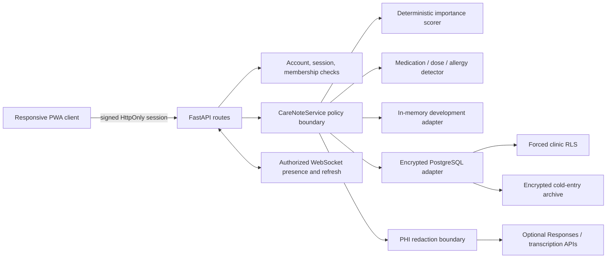
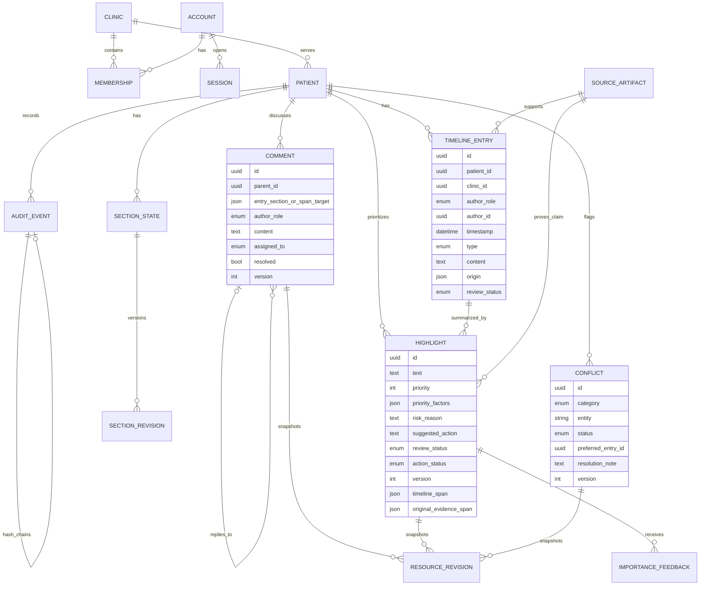

# Nightingale Care Note — Technical Brief

## Product thesis and scope

Nightingale is a provenance-first longitudinal care note for a synthetic patient. The primary
product question is: can a care-team member understand what needs attention, why it matters, what
action remains open, and where each claim came from within ten seconds?

The implementation deliberately favors a narrow, auditable vertical slice over a general-purpose
EHR or document editor. It combines patient, staff, clinician, and AI-scribed information in one
timeline; derives a deterministic Glance ranking; exposes claim-level evidence; supports scoped
comments and versioned care-plan editing; and prevents unreviewed AI content from becoming
patient-facing guidance.

All bundled records are deterministic and synthetic. This is an evaluation prototype, not a
medical device or a production clinical system.

## Architecture and trust boundaries

The browser is never an authorization boundary. Login produces an HMAC-signed, expiring token
whose claims bind actor, role, clinic, session ID, issue time, and expiry. The token is also set as
an HttpOnly, SameSite cookie. Server-side session state supports revocation and PostgreSQL stores
only a hash of the session ID. `system` cannot receive an interactive session, and legacy
actor/role/clinic request headers are not accepted.

`CareNoteService` enforces patient self-access, clinic scope, role ownership, authorship,
optimistic concurrency, publication rules, provenance integrity, and conflict adjudication.
PostgreSQL adds defense in depth: clinic-scoped tables use forced RLS against the transaction-local
`app.current_clinic_id`. Clinical snapshots and cold archives are authenticated-encrypted before
database storage.

The default adapter remains in memory for reproducible evaluation. PostgreSQL migrations and the
adapter are implemented, but this repository has not been validated against the target managed
database. Production use therefore still requires real migration, cross-clinic RLS, backup,
restore, failover, and key-rotation tests.

## Core data model

The timeline distinguishes doctor–patient AI summaries, nurse–patient AI summaries, and
AI–patient session summaries from manual patient, staff, and clinician notes. AI entries use
`author_role=system`, retain their interaction type and original artifact pointer, and are visibly
marked as unconfirmed.

Provenance has two independently validated hops. A Highlight first points to an exact character
span in a Timeline entry. It also stores a claim-level pointer to an exact span in the original
message, transcript, or manual note. The repository rejects missing, cross-patient, or
out-of-bounds timeline spans. Non-verbatim generated claims require explicit original-source
offsets instead of silently treating an entire transcript as evidence.

Comments bind to a whole entry, a whole section, or an exact character range. Comments support
replies, role mentions, assignment, resolve/reopen, optimistic locking, and complete snapshots.
Highlights and conflicts also store full revision snapshots. Care-plan sections store full content
snapshots plus unified diffs and can be restored by creating a new auditable version. Comment,
Highlight, and Conflict restore operations are not yet implemented; their history is viewable and
comparable but not revertible.

## Importance, learning, conflict, and patient safety

Glance ranking is deterministic. Each displayed total is recomputed from visible factors:

- explicit risk level;
- recency relative to the latest entry;
- safety-sensitive entity categories such as medication, dose, allergy, and symptom;
- open, in-progress, or completed action state;
- clinician-confirmed or rejected review state; and
- clinician authorship.

No model-reported confidence is used. Safety factors create a stable floor, completed work is
demoted, and rejected suggestions remain visible in history. Initial seed scores, live scores, and
revision snapshots use the same scorer so the number does not change merely because a view was
opened.

The adaptive component records impressions separately from human review outcomes. It activates
only after three reviewed items with a matching clinical-entity signature, caps its adjustment at
plus or minus eight points, and shrinks the adjustment when reviewed items are a small fraction of
exposures. This is a bounded workflow preference signal, not learned clinical truth. The current
prototype learns from confirm/reject outcomes; manual edits and comment signals are a documented
next step.

Conflict detection intentionally abstains outside a narrow, auditable scope. Deterministic patterns
extract medication state, dose, and allergy polarity. A clinician-authored fact receives explicit
precedence, while the contradiction remains visible until a clinician or admin confirms or resolves
it with a note. Detection, confirmation, reopening, and resolution have persistent snapshots and
metadata-only audit events.

Patient-facing output follows a stricter publication rule. Patients cannot access raw AI entries,
internal comments, assignments, provenance, or internal risk reasoning. They receive only public
patient-authored entries and a reduced action projection when a Highlight is clinician-confirmed
and has a separate patient instruction. AI-suggested guidance is never published directly.

## AI, privacy, audit, and lifecycle

The optional text-ingestion path stores the original source internally, removes known patient names,
medical-record identifiers, supported national IDs, and Singapore/China phone patterns, then calls
the OpenAI Responses API with `store=false` and a hashed safety identifier. The prompt instructs
the model to preserve uncertainty and avoid inventing diagnoses, doses, allergies, dates, or
certainty. The resulting Timeline entry remains `ai_suggested` until human review. Without an API
key, the adapter fails closed with a service-unavailable response.

Browser recording and transcription are implemented as an optional clinical workflow. The
transcript schema preserves speaker, timestamp, and confidence fields when a provider returns them
and uses `unknown`/`null` rather than inventing values. A strict unresolved privacy gap remains:
external transcription receives audio before text redaction is possible. Production deployment
must use an approved transcription boundary—such as local/on-premises ASR or a covered compliant
processor—before claiming pre-model PHI redaction. Patient-side voice capture and validated
diarization, code-switching, overlap, and noisy-room handling are also not complete.

Request logs contain method, path, response status, and duration only; they omit query values,
headers, cookies, and bodies. Audit events contain actor, resource, operation, version, and time,
not clinical content. Each event includes the previous event hash and its own canonical SHA-256
hash. PostgreSQL writes an additional audit-chain anchor. This is tamper-evident, not immutable
WORM storage; a production system must export anchors to an immutable compliance destination.

The cold-storage policy selects staff or patient entries older than 180 days only when they are not
referenced by a Highlight or unresolved conflict and do not match a narrow safety pattern. It keeps
a compressed extractive summary and encrypted reversible original. This proves lifecycle logic but
does not replace production object storage, legal holds, retention approval, or restore drills.

## Performance and verification

The benchmark exercises the real FastAPI route through `TestClient` after 100 warm-up requests and
measures 1,000 sequential requests against the single-patient in-memory dataset. The latest local
run measured 1.535 ms P95, below the 300 ms prototype target. It excludes a real network,
PostgreSQL, concurrent users, and representative longitudinal volume, so it is not a production
capacity claim.

The automated suite currently contains 45 passing tests covering bidirectional RBAC, patient
filtering, signed-token tampering and expiry, different-role concurrent edits, stale same-section
writes, arbitrary section diffs, provenance resolution, exact section comment spans, allergy
conflicts, resource histories, AI redaction, and authorized WebSocket presence.

## Deliberate trade-offs and next steps

- A single synthetic patient proves the vertical slice, not clinic-scale administration.
- Vanilla JavaScript minimizes build risk but does not provide a rich collaborative editor.
- Optimistic locking is deterministic; automatic merge and live cursor-level co-editing are absent.
- Complete snapshots improve prototype auditability at the cost of storage volume.
- The PostgreSQL adapter stores one encrypted clinical snapshot per clinic for implementation
  speed; normalized production tables would improve queryability and independent retention.
- Formal enterprise identity, MFA/SSO, managed TLS certificates, KMS rotation, immutable audit
  export, real PostgreSQL/RLS tests, approved model validation, accessibility/usability studies,
  and clinical safety review remain required before production use.

The prototype's central trust decision is to make uncertainty and evidence visible, keep machine
output unconfirmed, and require a human publication boundary where an error could reach a patient.
