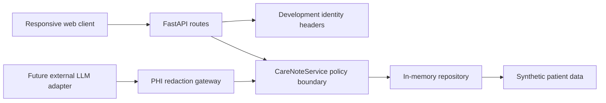
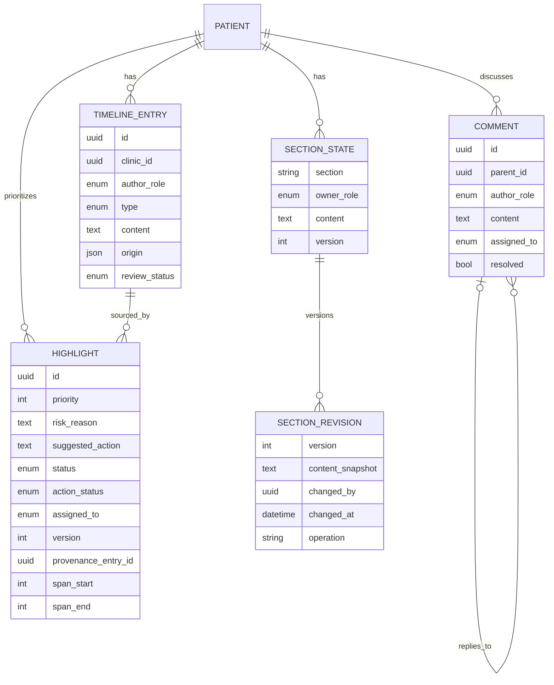

# Nightingale Care Note — Technical Brief

## Product decision

This prototype optimizes for one clinical question: can a care-team member understand what needs
attention, why it matters, and where the claim came from in ten seconds? It therefore implements a
narrow single-patient vertical slice instead of a general-purpose EHR or document editor. All data
is deterministic and synthetic.

## Architecture and trust boundaries



The browser is not a security boundary. Clinic scope, patient self-access, section ownership,
comment access, authorship and optimistic concurrency are checked on the server. Development
headers make the prototype easy to demonstrate but are not authentication. A production path must
verify signed identities, use PostgreSQL row-level security, encrypt data in transit and at rest,
and retain auditable metadata under an explicit retention policy.

The patient response uses an explicit publication rule rather than merely hiding internal UI.
It returns only patient-authored public entries plus a reduced `PatientAction` projection for a
Highlight that is both clinician-confirmed and supplied with a separate patient-facing
instruction. The projection omits provenance, internal risk reasoning, assignment and staff
comments. Draft or AI-suggested patient instructions remain server-side.

No external LLM is connected. A deterministic `PHIRedactionGateway` is present as the mandatory
boundary for any future model adapter. It removes caller-supplied known names, Singapore identity
numbers and Singapore/China phone numbers. This is a tested boundary, not a claim of comprehensive
clinical de-identification; a production gateway would need broader entity recognition, policy
versioning, human review and adversarial evaluation.

## Data relationships



Three AI-scribed types are independent timeline entries: doctor consult, nurse consult and patient
session summaries. They retain source labels and review status and never impersonate a clinician.
A highlight points to an exact entry and character span; the repository rejects missing,
cross-patient or out-of-bounds sources.

Internal collaborators can assign each highlight and move its action through open, in-progress,
and completed states. Clinician confirmation and rejection remain limited to clinicians and
admins. Every update uses an expected version to prevent stale writes and emits a metadata-only
audit event. The web client renders the exact source span and includes a synthetic role switcher
for demonstrating server-side patient filtering.

Staff can add a manual Timeline note through a role-derived server operation: the browser supplies
only title and content, while the service assigns author, clinic and entry type. A clinician can
select an exact span from an existing manual or AI entry and create a new Highlight. The server
derives the Highlight text from the stored source rather than trusting client-supplied text, then
records both note and Highlight creation in the audit stream.

Comment creation, replies, resolve/reopen, patient-authored updates, Highlight review,
assignment/completion, section edits and reverts all emit metadata-only audit events. Comment
resolution increments a lightweight comment version so successive lifecycle changes remain
distinguishable without copying comment text into the audit stream.

Comments support reply relationships, role mentions, assignment, resolve and reopen. Section
edits store complete snapshots and unified diffs. A separate audit stream contains actor, time,
resource, version and operation metadata but no clinical body text. A matching expected version is required, so stale writes return a
conflict rather than silently overwriting another user. Revert creates a new auditable version; it
does not delete history.

## Importance logic

The synthetic Glance ranking is deterministic. Clinician-confirmed medication action ranks above
an unconfirmed low blood-pressure observation, which ranks above an unresolved AI-derived task.
Every item exposes its score, risk reason, action and exact source. This favors explainability over
a black-box ranking model. The bonus self-learning mechanism is intentionally not implemented:
care-team feedback must not silently mutate clinical truth.

## Performance evidence

The benchmark calls the real FastAPI route through its test client after warm-up, using the seeded
dataset (one patient, six timeline entries, three highlights, one section). Run:

```powershell
.\.venv\Scripts\python.exe scripts\benchmark_glance.py --iterations 1000 --warmup 100
```

The result is machine- and adapter-specific and is recorded in `docs/PERFORMANCE.md`. Passing the
300 ms prototype target with an in-memory adapter is not evidence that a production database,
network or representative clinical dataset will meet the same target.

## Assumptions and trade-offs

- A single synthetic patient is enough to prove the vertical slice, not scalability.
- Full section snapshots are clearer and safer than compact diffs at prototype scale.
- Optimistic locking is deterministic; live co-editing and automatic merge are out of scope.
- Vanilla JavaScript minimizes build risk but gives fewer editor and component primitives.
- The in-memory adapter makes tests reproducible but deliberately resets on restart.
- Metadata-only audit records avoid duplicating sensitive body text into logs; revision snapshots
  remain clinical data and require the same storage protections as current content.

## Production gaps

Production readiness requires signed authentication, durable storage and RLS, comprehensive PHI
policy enforcement, TLS and key management, immutable audit controls, monitoring, retention and
deletion workflows, accessibility/usability validation, clinical safety review, representative
load testing and regulatory assessment. This repository is a demonstration prototype, not a
medical device.
